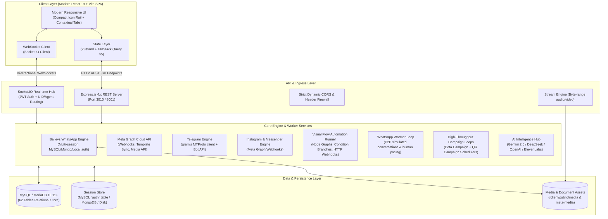
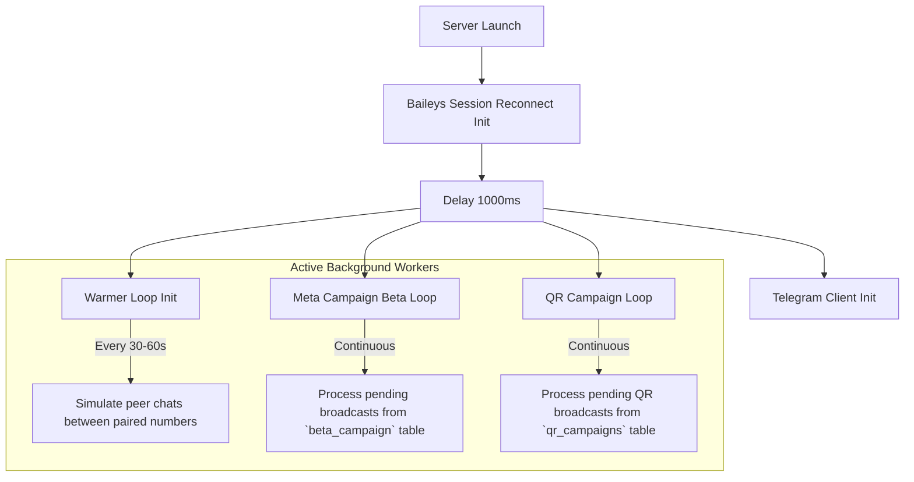

# WhatsCRM — Master Architecture & System Blueprint

> **System Version Analyzed**: WhatsCRM v6.1.0 (Enterprise Omnichannel SaaS)  
> **Target Architecture**: Decoupled High-Performance React + Vite Frontend & Node.js/Express Real-time Micro-Engine  
> **Core Purpose**: Rebuilding the frontend to modern, state-of-the-art standards while maintaining **100% feature parity** with the backend API, WebSocket events, database schema, background loops, and multi-channel engines.

---

## 1. System Overview & Architectural Topology

WhatsCRM is an enterprise-grade omnichannel customer engagement, marketing automation, and CRM platform. It provides a single unified interface to interact with WhatsApp (both **Official Meta Cloud API** and **WhatsApp Web Baileys QR sessions**), **Telegram** (Bot & MTProto User client), **Instagram DM**, and **Facebook Messenger**, integrated with visual workflow automation, AI assistants, number warmers, and Kanban sales pipelines.



---

## 2. Core Subsystems & Components

### 2.1 API & Routing Layer (`routes/` — 23 Modules, 378 Endpoints)
The REST API is divided into 23 distinct route modules serving specific operational domains:

1. **User & Workspace (`/api/user`)**: 73 endpoints handling user registration, authentication, workspace configuration, billing & Stripe/MercadoPago orders, Meta Cloud credentials, contact groups, quick replies, tags, number warmers, and daily analytics.
2. **Admin & Platform Control (`/api/admin`)**: 62 endpoints managing SaaS users, subscription plans, platform settings, payment gateways, SMTP configuration, custom landing page CMS, translations editor, and global analytics.
3. **Agent & Multi-Seat Support (`/api/agent`)**: 29 endpoints governing agent login, agent chat assignment, internal task boards, notes, agent spend time tracking, and RBAC permissions.
4. **Visual Chat Flow Builder (`/api/chat_flow`)**: 20 endpoints for creating, editing, and executing visual automation node graphs (`flow`, `flow_data`, `flow_session`, `flow_templates`).
5. **Multi-Channel Inbox (`/api/inbox`)**: 5 core endpoints supporting conversation retrieval, message histories, note attachments, label tagging, and agent assignment.
6. **Meta Cloud Broadcasts (`/api/broadcast`)**: 14 endpoints orchestrating mass messaging campaigns via official WhatsApp Meta Cloud API with CSV contact mapping and template variables.
7. **Baileys QR Sessions (`/api/qr`)**: 13 endpoints managing WhatsApp Web device sessions, live QR code generation, pairing status, session reconnects, and number warmers.
8. **Baileys QR Campaigns (`/api/qr_campaign`)**: 9 endpoints controlling mass messaging campaigns dispatched through paired WhatsApp Web numbers with interval throttling.
9. **Kanban CRM Pipeline (`/api/kaban`)**: 3 endpoints powering dynamic deal stages, stage transitions, lead cards, and CRM workflow integrations.
10. **Contacts & Phonebook (`/api/phonebook`)**: 10 endpoints managing contacts, contact groups, CSV bulk imports, and export operations.
11. **Keyword Chatbot (`/api/chatbot`)**: 4 endpoints managing exact/partial keyword match rules and automated auto-replies.
12. **AI Assistants (`/api/ai`)**: 2 endpoints for generative AI prompts, contextual responses, and smart conversation summaries.
13. **WhatsApp Voice & Calls (`/api/wa_call`)**: 19 endpoints for WhatsApp WebRTC voice calls, call bots, interactive voice flows, and audio logs.
14. **Dynamic Forms Builder (`/api/waform`)**: 8 endpoints powering conversational lead-capture forms, dynamic questions, validation, and submission data.
15. **Telegram Integration (`/api/telegram`)**: 15 endpoints managing Telegram Bot API keys and MTProto user phone number login sessions.
16. **Instagram DM (`/api/insta`)**: 6 endpoints for Instagram Graph API account connection, webhook routing, and direct messaging.
17. **Facebook Messenger (`/api/messenger`)**: 10 endpoints for Messenger page linkage, page tokens, and incoming webhooks.
18. **Message Templates (`/api/templet`)**: 3 endpoints syncing and approving official WhatsApp Cloud API templates with Meta.
19. **Theme & Landing CMS (`/api/theme`)**: 27 endpoints configuring frontend landing page themes, typography, colors, navigation links, and showcase cards.
20. **Public Web Portal (`/api/web`)**: 26 endpoints for public landing page content, pricing packages, FAQs, partner logos, blogs, and public contact submissions.
21. **Inbound Webhooks (`/api/webhook` & `/api/webhookNo`)**: 16 endpoints for third-party inbound webhooks (WooCommerce, Shopify, custom CRM) with payload mapping.
22. **Developer REST API v1 (`/api/v1` / `apiv2.js`)**: 4 endpoints providing external programmatic access to send messages and trigger campaigns via API keys.

---

### 2.2 Real-Time WebSocket Infrastructure (`socket.js` & `helper/socket/`)
WhatsCRM utilizes Socket.IO with a unified token-based authentication handshake:
- **Authentication**: JWT verification via query parameter `token` (checked against `process.env.JWTKEY`).
- **Connection Registry**: Tracks user and agent sessions (`socket.userData = { uid, role, isAgent, owner_uid }`).
- **Targeted Dispatchers**:
  - `sendToUid(uid, data, event)`: Sends events to the workspace owner and all logged-in sub-agents of that workspace.
  - `sendToSocket(socketId, data, event)`: Direct single-socket communication.
  - `sendToAll(data, event)`: Broadcasts platform-wide notices.

#### Key WebSocket Client Actions (Client $\rightarrow$ Server):
- `get_chat_list`: Filtered, paginated conversation retrieval (supports multi-channel origin, agent assignment, unread filters, tag filters, date ranges).
- `load_conversation`: Fetches full message timeline for a specific conversation ID.
- `send_chat_message`: Dispatches text, media (image, audio, video, document), or voice notes across WhatsApp, Telegram, Instagram, or Messenger.
- `send_template_to_conversation`: Sends an approved Meta template message.
- `assign_agent_to_chat` / `unasign_chat_agent`: Live agent reassignment.
- `set_chat_label` / `remove_chat_label`: Dynamic color-coded tagging.
- `save_chat_note` / `delete_chat_note`: Internal agent collaboration notes.
- `translate_message` & `suggest_reply`: Instant AI message translation and contextual reply generation.
- `export_chats` & `export_conversation`: Async export generation.

#### Key WebSocket Server Pushes (Server $\rightarrow$ Client):
- `chat_list`: Updated conversation array with unread counts and latest message previews.
- `load_conversation`: Timeline message objects with delivery status indicators.
- `push_new_msg` / `update_conversations`: Instant incoming/outgoing message pushes.
- `request_update_chat_list` / `request_update_opened_chat`: Signals client components to refresh active UI states.
- `translation_result` / `suggestion_result`: Streaming AI response payloads.

---

### 2.3 Background Execution Loops & Workers (`loops/`)
The server runs four persistent asynchronous loops initialized on server start:



1. **Meta Campaign Loop (`loops/campaignBeta.js`)**:
   - Queries `beta_campaign` table where `status = 'pending'`.
   - Reads contact batch and dispatches via Meta Cloud API using rate pacing and delivery log recording in `beta_campaign_logs`.
   - Handles variable substitution (`{{name}}`, `{{phone}}`, `{{var1}}`, `{{var2}}`).
2. **QR Campaign Loop (`loops/qrCampaignLoop.js`)**:
   - Queries `qr_campaigns` table where `status = 'pending'`.
   - Distributes messages across selected paired WhatsApp Web numbers (`mysql-baileys` sessions).
   - Injects random sleep intervals (e.g., 5–15 seconds) to emulate human typing and safeguard accounts against anti-spam bans.
3. **Number Warmer Loop (`helper/addon/qr/warmer/index.js`)**:
   - Reads configured warmers from `warmers` and `warmer_script` tables.
   - Automatically pairs two or more connected WhatsApp numbers in an automated reciprocal conversation matrix.
   - Gradually ramps up daily message volume to build domain/number reputation on WhatsApp servers.

---

### 2.4 Multi-Channel Engine Architecture

| Channel | Protocol / Library | Session Persistence | Webhook / Ingress Route | Key Capabilities |
| :--- | :--- | :--- | :--- | :--- |
| **WhatsApp Meta Cloud API** | Official Meta Graph API v18+ | MySQL `meta_api` table | `/api/webhook` | Verified blue-badge support, high-throughput, approved interactive button templates, catalog messages. |
| **WhatsApp Web (Baileys QR)** | `@whiskeysockets/baileys` (v7.0) | MySQL `auth` table / Mongo / Local disk | Native WebSocket socket hook | Works with any standard WhatsApp number, no Meta business verification required, QR scan pairing. |
| **Telegram** | `telegram` (gramjs MTProto) + Bot API | MySQL `telegram_session` | Polling / MTProto client | User account client (login with phone code) + Bot API channel messaging. |
| **Instagram DM** | Meta Graph API (Instagram Messaging) | MySQL `instagram_accounts` | `/api/insta/webhook` | Direct messages, media attachments, story mentions, quick replies. |
| **Facebook Messenger** | Meta Graph API (Page Messaging) | MySQL `messenger_accounts` | `/api/messenger/webhook` | Page conversations, rich media cards, automated responses. |

---

### 2.5 Visual Automation & Chat Flow Builder (`automation/`)
The visual automation builder uses a node-edge graph structure:
- **Triggers**: Keyword triggers, incoming message from any channel, webhook event, form submission, new contact added.
- **Action Nodes**:
  - `Send Message`: Text, Image, Audio, Video, Document, Location.
  - `Send Interactive`: Buttons, List menus, Template messages.
  - `Condition Branching`: Regex match, variable comparison, business hours check.
  - `AI Generator`: Query Gemini / OpenAI / DeepSeek with prompt context and pass answer to user.
  - `HTTP Request / Webhook`: Make external GET/POST API calls with payload data.
  - `CRM Action`: Assign contact to Kanban stage, add/remove tags, assign team agent.
  - `Delay / Wait`: Sleep timer before sending subsequent messages.
- **Execution Engine (`automation/functions.js`)**: Stateful session tracking in `flow_session` table with variable memory.

---

### 2.6 User Roles & Permissions (RBAC)

```
┌──────────────────────────────────────────────────────────┐
│                   Super Administrator                    │
│  - Complete SaaS platform ownership                      │
│  - Manage SaaS subscriptions, pricing plans, and limits  │
│  - Payment gateway settings (Stripe, MercadoPago, etc.)  │
│  - Multi-language translation management                 │
│  - Platform CMS & theme customizations                   │
└────────────────────────────┬─────────────────────────────┘
                             │
┌────────────────────────────▼─────────────────────────────┐
│                     Workspace Owner                      │
│  - Tenant account with quota limits based on active plan │
│  - Connect WhatsApp Cloud API & Baileys QR numbers       │
│  - Connect Telegram, Instagram, and Messenger channels   │
│  - Manage contacts, Kanban CRM pipelines, and campaigns  │
│  - Create visual automations and AI chatbots             │
│  - Invite and manage Team Agents                         │
└────────────────────────────┬─────────────────────────────┘
                             │
┌────────────────────────────▼─────────────────────────────┐
│                       Team Agent                         │
│  - Restricted workspace access governed by permissions   │
│  - View and reply to assigned chats in live inbox        │
│  - Manage assigned Kanban deals and leads                │
│  - Access internal contact notes and quick replies       │
└──────────────────────────────────────────────────────────┘
```

---

## 3. Directory & File Blueprint

```
WhatsCRM/
├── extract_to _server/             # Backend Node.js Server
│   ├── app.js / server.js         # Entry point, Express setup, Socket.io initialization, static media
│   ├── routes/                    # 23 REST API route controllers (378 endpoints)
│   ├── helper/                    # Channel adapters (Baileys QR, Telegram, Meta, Socket processing)
│   ├── loops/                     # Background workers (Meta Campaign, QR Campaign, Warmer)
│   ├── automation/                # Visual Flow graph runner, Google Gemini AI, Webhook processor
│   ├── functions/                 # Core database helper functions & message dispatchers
│   ├── middlewares/               # JWT authentication, plan limit enforcement, license verification
│   ├── database/                  # MySQL connection pool & promise wrappers
│   ├── languages/                 # i18n localization dictionaries (English.json master)
│   └── client/public/             # Static build output & uploads (/media, /meta-media)
├── database/
│   └── import.sql                 # Complete 62-table MySQL dump schema & seeds
└── frontend/                      # Modern Rebuilt Frontend (React 19 + Vite + Tailwind CSS)
    ├── src/
    │   ├── api/                   # Typed API service clients for all 23 backend modules
    │   ├── components/            # Reusable UI component library (Design System)
    │   ├── context/               # Global state contexts (Auth, Socket, Theme, i18n)
    │   ├── layouts/               # Metronic Rail Sidebar Layout & Sub-Navigation Header
    │   ├── pages/                 # Full feature parity pages (Inbox, CRM, Flows, Campaigns, etc.)
    │   ├── hooks/                 # Custom hooks (useSocket, useChat, useFlow, useKanban)
    │   └── utils/                 # Formatters, date helpers, sound notifications
```

---

## 4. Rebuilding Blueprint & Quality Checklist

1. **Zero Feature Regression**: Every route, modal, filter, and background operation in the 23 backend controllers must have a corresponding modern UI counterpart.
2. **WebSocket Synchronization**: Live bi-directional updates for incoming chats, agent typing, QR code pairing status, and campaign progress.
3. **Decoupled Architecture**: Clean separation between frontend API clients and backend endpoints, enabling zero-downtime upgrades.
4. **Information Density**: Maximized viewport real estate using the Metronic-style Compact Icon Rail + Contextual Horizontal Sub-Navbar design pattern.
