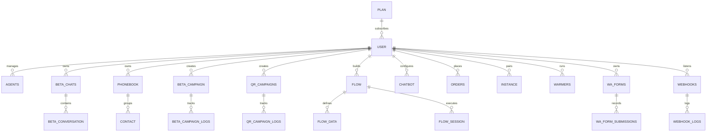

# WhatsCRM Database Schema Specification (62 Tables)

> **Database Engine**: MariaDB 10.11+ / MySQL 8.0+
> **Character Set**: `utf8mb4` / `utf8mb4_unicode_ci`
> **Source Dump**: `database/import.sql`

---

## 1. High-Level Entity Relationship Overview

---

## 2. Complete Catalog of Tables & Data Dictionaries

### User, Authentication & RBAC

#### Table: `admin`
| Column | Data Type | Nullable / Attributes | Description / Purpose |
| :--- | :--- | :--- | :--- |
| `id` | `int(11)` | NOT NULL AUTO_INCREMENT | Field definition |
| `email` | `varchar(999)` | DEFAULT NULL | Field definition |
| `password` | `varchar(999)` | DEFAULT NULL | Field definition |
| `uid` | `varchar(999)` | DEFAULT NULL | Field definition |
| `role` | `varchar(999)` | NOT NULL DEFAULT 'admin' | Field definition |
| `createdAt` | `timestamp` | NOT NULL DEFAULT current_timestamp() | Field definition |
| `tokenVersion` | `int(11)` | DEFAULT 0 | Field definition |

**Primary Key**: `PRIMARY KEY (`id`)`

#### Table: `user`
| Column | Data Type | Nullable / Attributes | Description / Purpose |
| :--- | :--- | :--- | :--- |
| `id` | `int(11)` | NOT NULL AUTO_INCREMENT | Field definition |
| `role` | `varchar(999)` | DEFAULT 'user' | Field definition |
| `uid` | `varchar(999)` | DEFAULT NULL | Field definition |
| `name` | `varchar(999)` | DEFAULT NULL | Field definition |
| `email` | `varchar(999)` | DEFAULT NULL | Field definition |
| `password` | `varchar(999)` | DEFAULT NULL | Field definition |
| `mobile_with_country_code` | `varchar(999)` | DEFAULT NULL | Field definition |
| `timezone` | `varchar(999)` | DEFAULT 'Asia/Kolkata' | Field definition |
| `plan` | `longtext` | DEFAULT NULL | Field definition |
| `plan_expire` | `varchar(999)` | DEFAULT NULL | Field definition |
| `trial` | `int(1)` | DEFAULT 0 | Field definition |
| `api_key` | `varchar(999)` | DEFAULT NULL | Field definition |
| `createdAt` | `timestamp` | NOT NULL DEFAULT current_timestamp() | Field definition |
| `fcm_data` | `longtext` | DEFAULT NULL | Field definition |
| `fcm_inbox` | `longtext` | DEFAULT NULL | Field definition |
| `tokenVersion` | `int(11)` | DEFAULT 0 | Field definition |

**Primary Key**: `PRIMARY KEY (`id`),`

#### Table: `agents`
| Column | Data Type | Nullable / Attributes | Description / Purpose |
| :--- | :--- | :--- | :--- |
| `id` | `int(11)` | NOT NULL AUTO_INCREMENT | Field definition |
| `owner_uid` | `varchar(999)` | DEFAULT NULL | Field definition |
| `uid` | `varchar(999)` | DEFAULT NULL | Field definition |
| `role` | `varchar(999)` | DEFAULT 'agent' | Field definition |
| `email` | `varchar(999)` | DEFAULT NULL | Field definition |
| `password` | `varchar(999)` | DEFAULT NULL | Field definition |
| `name` | `varchar(999)` | DEFAULT NULL | Field definition |
| `mobile` | `varchar(999)` | DEFAULT NULL | Field definition |
| `comments` | `longtext` | DEFAULT NULL | Field definition |
| `is_active` | `int(1)` | DEFAULT 1 | Field definition |
| `createdAt` | `timestamp` | NULL DEFAULT current_timestamp() | Field definition |
| `logs` | `longtext` | DEFAULT NULL | Field definition |
| `mask_number` | `int(11)` | DEFAULT 1 | Field definition |
| `allow_send_new_qr` | `int(11)` | DEFAULT 0 | Field definition |
| `allow_save_contact` | `int(11)` | DEFAULT 0 | Field definition |
| `fcm_data` | `longtext` | DEFAULT NULL | Field definition |
| `tokenVersion` | `int(11)` | DEFAULT 0 | Field definition |

**Primary Key**: `PRIMARY KEY (`id`),`

#### Table: `agent_chats`
| Column | Data Type | Nullable / Attributes | Description / Purpose |
| :--- | :--- | :--- | :--- |
| `id` | `int(11)` | NOT NULL AUTO_INCREMENT | Field definition |
| `owner_uid` | `varchar(999)` | DEFAULT NULL | Field definition |
| `uid` | `varchar(999)` | DEFAULT NULL | Field definition |
| `chat_id` | `varchar(999)` | DEFAULT NULL | Field definition |
| `createdAt` | `timestamp` | NULL DEFAULT current_timestamp() | Field definition |

**Primary Key**: `PRIMARY KEY (`id`)`

#### Table: `agent_task`
| Column | Data Type | Nullable / Attributes | Description / Purpose |
| :--- | :--- | :--- | :--- |
| `id` | `int(11)` | NOT NULL AUTO_INCREMENT | Field definition |
| `owner_uid` | `varchar(999)` | DEFAULT NULL | Field definition |
| `uid` | `varchar(999)` | DEFAULT NULL | Field definition |
| `title` | `varchar(999)` | DEFAULT NULL | Field definition |
| `description` | `longtext` | DEFAULT NULL | Field definition |
| `agent_comments` | `longtext` | DEFAULT NULL | Field definition |
| `status` | `varchar(999)` | DEFAULT NULL | Field definition |
| `createdAt` | `timestamp` | NULL DEFAULT current_timestamp() | Field definition |

**Primary Key**: `PRIMARY KEY (`id`)`

#### Table: `g_auth`
| Column | Data Type | Nullable / Attributes | Description / Purpose |
| :--- | :--- | :--- | :--- |
| `id` | `int(11)` | NOT NULL AUTO_INCREMENT | Field definition |
| `uid` | `varchar(999)` | DEFAULT NULL | Field definition |
| `label` | `varchar(999)` | DEFAULT NULL | Field definition |
| `url` | `longtext` | DEFAULT NULL | Field definition |
| `createdAt` | `timestamp` | NULL DEFAULT current_timestamp() | Field definition |

**Primary Key**: `PRIMARY KEY (`id`)`

#### Table: `fcm_tokens`
| Column | Data Type | Nullable / Attributes | Description / Purpose |
| :--- | :--- | :--- | :--- |
| `id` | `int(11)` | NOT NULL AUTO_INCREMENT | Field definition |
| `uid` | `varchar(999)` | DEFAULT NULL | Field definition |
| `token` | `text` | DEFAULT NULL | Field definition |
| `other` | `longtext` | DEFAULT NULL | Field definition |
| `createdAt` | `timestamp` | NULL DEFAULT current_timestamp() | Field definition |
| `updatedAt` | `timestamp` | NULL DEFAULT current_timestamp() ON UPDATE current_timestamp() | Field definition |

**Primary Key**: `PRIMARY KEY (`id`)`

### Multi-Channel Live Inbox & Messaging

#### Table: `beta_chats`
| Column | Data Type | Nullable / Attributes | Description / Purpose |
| :--- | :--- | :--- | :--- |
| `id` | `int(11)` | NOT NULL AUTO_INCREMENT | Field definition |
| `uid` | `varchar(999)` | DEFAULT NULL | Field definition |
| `old_chat_id` | `varchar(999)` | DEFAULT NULL | Field definition |
| `profile` | `longtext` | DEFAULT NULL | Field definition |
| `origin_instance_id` | `varchar(999)` | DEFAULT NULL | Field definition |
| `chat_id` | `varchar(999)` | DEFAULT NULL | Field definition |
| `last_message` | `longtext` | DEFAULT NULL | Field definition |
| `chat_label` | `longtext` | DEFAULT NULL | Field definition |
| `chat_note` | `longtext` | DEFAULT NULL | Field definition |
| `sender_name` | `varchar(999)` | DEFAULT NULL | Field definition |
| `sender_mobile` | `varchar(999)` | DEFAULT NULL | Field definition |
| `unread_count` | `bigint(20)` | DEFAULT 0 | Field definition |
| `origin` | `varchar(999)` | DEFAULT NULL | Field definition |
| `assigned_agent` | `longtext` | DEFAULT NULL | Field definition |
| `createdAt` | `timestamp` | NULL DEFAULT current_timestamp() | Field definition |
| `updatedAt` | `timestamp` | NULL DEFAULT current_timestamp() ON UPDATE current_timestamp() | Field definition |
| `kanban_order` | `int(11)` | DEFAULT 0 | Field definition |

**Primary Key**: `PRIMARY KEY (`id`),`

#### Table: `beta_conversation`
| Column | Data Type | Nullable / Attributes | Description / Purpose |
| :--- | :--- | :--- | :--- |
| `id` | `int(11)` | NOT NULL AUTO_INCREMENT | Field definition |
| `type` | `varchar(999)` | DEFAULT NULL | Field definition |
| `chat_id` | `varchar(999)` | DEFAULT NULL | Field definition |
| `uid` | `varchar(999)` | DEFAULT NULL | Field definition |
| `status` | `varchar(999)` | DEFAULT NULL | Field definition |
| `metaChatId` | `varchar(999)` | DEFAULT NULL | Field definition |
| `msgContext` | `longtext` | DEFAULT NULL | Field definition |
| `reaction` | `varchar(999)` | DEFAULT NULL | Field definition |
| `timestamp` | `varchar(999)` | DEFAULT NULL | Field definition |
| `senderName` | `varchar(999)` | DEFAULT NULL | Field definition |
| `senderMobile` | `varchar(999)` | DEFAULT NULL | Field definition |
| `star` | `varchar(999)` | DEFAULT NULL | Field definition |
| `route` | `varchar(999)` | DEFAULT NULL | Field definition |
| `context` | `longtext` | DEFAULT NULL | Field definition |
| `origin` | `varchar(999)` | DEFAULT NULL | Field definition |
| `createdAt` | `timestamp` | NULL DEFAULT current_timestamp() | Field definition |
| `sentBy` | `varchar(999)` | DEFAULT NULL | Field definition |
| `err` | `longtext` | DEFAULT NULL | Field definition |

**Primary Key**: `PRIMARY KEY (`id`),`

#### Table: `chats`
| Column | Data Type | Nullable / Attributes | Description / Purpose |
| :--- | :--- | :--- | :--- |
| `id` | `int(11)` | NOT NULL AUTO_INCREMENT | Field definition |
| `chat_id` | `varchar(999)` | DEFAULT NULL | Field definition |
| `uid` | `varchar(999)` | DEFAULT NULL | Field definition |
| `last_message_came` | `varchar(999)` | DEFAULT NULL | Field definition |
| `chat_note` | `longtext` | DEFAULT NULL | Field definition |
| `chat_tags` | `longtext` | DEFAULT NULL | Field definition |
| `sender_name` | `varchar(999)` | DEFAULT NULL | Field definition |
| `sender_mobile` | `varchar(999)` | DEFAULT NULL | Field definition |
| `chat_status` | `varchar(999)` | DEFAULT 'open' | Field definition |
| `is_opened` | `int(1)` | DEFAULT 0 | Field definition |
| `last_message` | `longtext` | DEFAULT NULL | Field definition |
| `createdAt` | `timestamp` | NOT NULL DEFAULT current_timestamp() | Field definition |
| `origin` | `varchar(999)` | DEFAULT 'meta' | Field definition |
| `profile` | `longtext` | DEFAULT NULL | Field definition |
| `other` | `longtext` | DEFAULT NULL | Field definition |

**Primary Key**: `PRIMARY KEY (`id`)`

#### Table: `chat_tags`
| Column | Data Type | Nullable / Attributes | Description / Purpose |
| :--- | :--- | :--- | :--- |
| `id` | `int(11)` | NOT NULL AUTO_INCREMENT | Field definition |
| `uid` | `varchar(999)` | DEFAULT NULL | Field definition |
| `hex` | `varchar(999)` | DEFAULT NULL | Field definition |
| `title` | `longtext` | DEFAULT NULL | Field definition |
| `createdAt` | `timestamp` | NULL DEFAULT current_timestamp() | Field definition |
| `show_on_kanban` | `tinyint(1)` | DEFAULT 1 | Field definition |

**Primary Key**: `PRIMARY KEY (`id`),`

#### Table: `quick_reply`
| Column | Data Type | Nullable / Attributes | Description / Purpose |
| :--- | :--- | :--- | :--- |
| `id` | `int(11)` | NOT NULL AUTO_INCREMENT | Field definition |
| `uid` | `varchar(999)` | DEFAULT NULL | Field definition |
| `msg` | `longtext` | DEFAULT NULL | Field definition |
| `createdAt` | `timestamp` | NULL DEFAULT current_timestamp() | Field definition |

**Primary Key**: `PRIMARY KEY (`id`),`

#### Table: `rooms`
| Column | Data Type | Nullable / Attributes | Description / Purpose |
| :--- | :--- | :--- | :--- |
| `id` | `int(11)` | NOT NULL AUTO_INCREMENT | Field definition |
| `uid` | `varchar(999)` | DEFAULT NULL | Field definition |
| `socket_id` | `varchar(999)` | DEFAULT NULL | Field definition |
| `createdAt` | `timestamp` | NOT NULL DEFAULT current_timestamp() | Field definition |

**Primary Key**: `PRIMARY KEY (`id`)`

### WhatsApp Meta Cloud API

#### Table: `meta_api`
| Column | Data Type | Nullable / Attributes | Description / Purpose |
| :--- | :--- | :--- | :--- |
| `id` | `int(11)` | NOT NULL AUTO_INCREMENT | Field definition |
| `uid` | `varchar(999)` | DEFAULT NULL | Field definition |
| `waba_id` | `varchar(999)` | DEFAULT NULL | Field definition |
| `business_account_id` | `varchar(999)` | DEFAULT NULL | Field definition |
| `access_token` | `varchar(999)` | DEFAULT NULL | Field definition |
| `business_phone_number_id` | `varchar(999)` | DEFAULT NULL | Field definition |
| `app_id` | `varchar(999)` | DEFAULT NULL | Field definition |
| `createdAt` | `timestamp` | NOT NULL DEFAULT current_timestamp() | Field definition |
| `embed_data` | `longtext` | DEFAULT NULL | Field definition |
| `login_type` | `varchar(999)` | DEFAULT 'manual' | Field definition |
| `is_coexistence` | `tinyint(1)` | DEFAULT 0 | Field definition |
| `platform_type` | `varchar(50)` | DEFAULT NULL | Field definition |

**Primary Key**: `PRIMARY KEY (`id`),`

#### Table: `meta_templet_media`
| Column | Data Type | Nullable / Attributes | Description / Purpose |
| :--- | :--- | :--- | :--- |
| `id` | `int(11)` | NOT NULL AUTO_INCREMENT | Field definition |
| `uid` | `varchar(999)` | DEFAULT NULL | Field definition |
| `templet_name` | `varchar(999)` | DEFAULT NULL | Field definition |
| `meta_hash` | `varchar(999)` | DEFAULT NULL | Field definition |
| `file_name` | `varchar(999)` | DEFAULT NULL | Field definition |
| `createdAt` | `timestamp` | NOT NULL DEFAULT current_timestamp() | Field definition |

**Primary Key**: `PRIMARY KEY (`id`)`

#### Table: `templets`
| Column | Data Type | Nullable / Attributes | Description / Purpose |
| :--- | :--- | :--- | :--- |
| `id` | `int(11)` | NOT NULL AUTO_INCREMENT | Field definition |
| `uid` | `varchar(999)` | DEFAULT NULL | Field definition |
| `content` | `longtext` | DEFAULT NULL | Field definition |
| `type` | `varchar(999)` | DEFAULT NULL | Field definition |
| `title` | `varchar(999)` | DEFAULT NULL | Field definition |
| `createdAt` | `timestamp` | NOT NULL DEFAULT current_timestamp() | Field definition |

**Primary Key**: `PRIMARY KEY (`id`)`

#### Table: `beta_campaign`
| Column | Data Type | Nullable / Attributes | Description / Purpose |
| :--- | :--- | :--- | :--- |
| `id` | `int(11)` | NOT NULL AUTO_INCREMENT | Field definition |
| `campaign_id` | `varchar(999)` | NOT NULL | Field definition |
| `uid` | `varchar(999)` | NOT NULL | Field definition |
| `title` | `varchar(999)` | NOT NULL | Field definition |
| `template_name` | `varchar(999)` | NOT NULL | Field definition |
| `template_language` | `varchar(999)` | NOT NULL | Field definition |
| `phonebook_id` | `varchar(999)` | NOT NULL | Field definition |
| `phonebook_name` | `varchar(999)` | NOT NULL | Field definition |
| `status` | `varchar(999)` | NOT NULL DEFAULT 'PENDING' | Field definition |
| `total_contacts` | `int(11)` | NOT NULL DEFAULT 0 | Field definition |
| `sent_count` | `int(11)` | NOT NULL DEFAULT 0 | Field definition |
| `delivered_count` | `int(11)` | NOT NULL DEFAULT 0 | Field definition |
| `read_count` | `int(11)` | NOT NULL DEFAULT 0 | Field definition |
| `failed_count` | `int(11)` | NOT NULL DEFAULT 0 | Field definition |
| `body_variables` | `longtext` | DEFAULT NULL | Field definition |
| `header_variable` | `longtext` | DEFAULT NULL | Field definition |
| `button_variables` | `longtext` | DEFAULT NULL | Field definition |
| `schedule` | `datetime` | DEFAULT NULL | Field definition |
| `timezone` | `varchar(999)` | DEFAULT NULL | Field definition |
| `createdAt` | `timestamp` | NOT NULL DEFAULT current_timestamp() | Field definition |
| `template_type` | `varchar(20)` | DEFAULT 'STANDARD' | Field definition |

**Primary Key**: `PRIMARY KEY (`id`)`

#### Table: `beta_campaign_logs`
| Column | Data Type | Nullable / Attributes | Description / Purpose |
| :--- | :--- | :--- | :--- |
| `id` | `int(11)` | NOT NULL AUTO_INCREMENT | Field definition |
| `uid` | `varchar(999)` | NOT NULL | Field definition |
| `campaign_id` | `varchar(999)` | NOT NULL | Field definition |
| `contact_name` | `varchar(999)` | NOT NULL | Field definition |
| `contact_mobile` | `varchar(999)` | NOT NULL | Field definition |
| `meta_msg_id` | `varchar(999)` | DEFAULT NULL | Field definition |
| `status` | `varchar(999)` | NOT NULL DEFAULT 'PENDING' | Field definition |
| `delivery_status` | `varchar(999)` | DEFAULT NULL | Field definition |
| `delivery_time` | `varchar(999)` | DEFAULT NULL | Field definition |
| `error_message` | `longtext` | DEFAULT NULL | Field definition |
| `createdAt` | `timestamp` | NOT NULL DEFAULT current_timestamp() | Field definition |

**Primary Key**: `PRIMARY KEY (`id`)`

#### Table: `broadcast`
| Column | Data Type | Nullable / Attributes | Description / Purpose |
| :--- | :--- | :--- | :--- |
| `id` | `int(11)` | NOT NULL AUTO_INCREMENT | Field definition |
| `broadcast_id` | `varchar(999)` | DEFAULT NULL | Field definition |
| `uid` | `varchar(999)` | DEFAULT NULL | Field definition |
| `title` | `varchar(999)` | DEFAULT NULL | Field definition |
| `templet` | `longtext` | DEFAULT NULL | Field definition |
| `phonebook` | `longtext` | DEFAULT NULL | Field definition |
| `status` | `varchar(999)` | DEFAULT NULL | Field definition |
| `schedule` | `datetime` | DEFAULT NULL | Field definition |
| `timezone` | `varchar(999)` | DEFAULT 'Asia/Kolkata' | Field definition |
| `createdAt` | `timestamp` | NOT NULL DEFAULT current_timestamp() | Field definition |

**Primary Key**: `PRIMARY KEY (`id`)`

#### Table: `broadcast_log`
| Column | Data Type | Nullable / Attributes | Description / Purpose |
| :--- | :--- | :--- | :--- |
| `id` | `int(11)` | NOT NULL AUTO_INCREMENT | Field definition |
| `uid` | `varchar(999)` | DEFAULT NULL | Field definition |
| `broadcast_id` | `varchar(999)` | DEFAULT NULL | Field definition |
| `templet_name` | `varchar(999)` | DEFAULT NULL | Field definition |
| `is_read` | `int(1)` | DEFAULT 0 | Field definition |
| `meta_msg_id` | `varchar(999)` | DEFAULT NULL | Field definition |
| `sender_mobile` | `varchar(999)` | DEFAULT NULL | Field definition |
| `send_to` | `varchar(999)` | DEFAULT NULL | Field definition |
| `delivery_status` | `varchar(999)` | DEFAULT 'PENDING' | Field definition |
| `delivery_time` | `varchar(999)` | DEFAULT NULL | Field definition |
| `err` | `longtext` | DEFAULT NULL | Field definition |
| `example` | `longtext` | DEFAULT NULL | Field definition |
| `contact` | `longtext` | DEFAULT NULL | Field definition |
| `createdAt` | `timestamp` | NOT NULL DEFAULT current_timestamp() | Field definition |

**Primary Key**: `PRIMARY KEY (`id`)`

### WhatsApp Web (Baileys QR) & Device Sessions

#### Table: `auth`
| Column | Data Type | Nullable / Attributes | Description / Purpose |
| :--- | :--- | :--- | :--- |
| `session` | `varchar(50)` | NOT NULL | Field definition |
| `id` | `varchar(80)` | NOT NULL | Field definition |
| `value` | `longtext` | CHARACTER SET utf8mb4 COLLATE utf8mb4_bin DEFAULT NULL CHECK (json_valid(`value`)) | Field definition |

#### Table: `instance`
| Column | Data Type | Nullable / Attributes | Description / Purpose |
| :--- | :--- | :--- | :--- |
| `id` | `int(11)` | NOT NULL AUTO_INCREMENT | Field definition |
| `uid` | `varchar(999)` | DEFAULT NULL | Field definition |
| `title` | `varchar(999)` | DEFAULT NULL | Field definition |
| `number` | `varchar(999)` | DEFAULT NULL | Field definition |
| `uniqueId` | `varchar(999)` | DEFAULT NULL | Field definition |
| `qr` | `longtext` | DEFAULT NULL | Field definition |
| `data` | `longtext` | DEFAULT NULL | Field definition |
| `other` | `longtext` | DEFAULT NULL | Field definition |
| `status` | `longtext` | DEFAULT NULL | Field definition |
| `createdAt` | `timestamp` | NULL DEFAULT current_timestamp() | Field definition |

**Primary Key**: `PRIMARY KEY (`id`),`

#### Table: `qr_campaigns`
| Column | Data Type | Nullable / Attributes | Description / Purpose |
| :--- | :--- | :--- | :--- |
| `id` | `int(11)` | NOT NULL AUTO_INCREMENT | Field definition |
| `uid` | `varchar(999)` | DEFAULT NULL | Field definition |
| `title` | `varchar(999)` | DEFAULT NULL | Field definition |
| `instance_id` | `varchar(999)` | DEFAULT NULL | Field definition |
| `phonebook_id` | `varchar(999)` | DEFAULT NULL | Field definition |
| `message_type` | `varchar(999)` | DEFAULT NULL | Field definition |
| `message_text` | `longtext` | DEFAULT NULL | Field definition |
| `media_url` | `longtext` | DEFAULT NULL | Field definition |
| `media_caption` | `longtext` | DEFAULT NULL | Field definition |
| `delay_min` | `int(11)` | DEFAULT 5 | Field definition |
| `delay_max` | `int(11)` | DEFAULT 15 | Field definition |
| `random_suffix` | `tinyint(4)` | DEFAULT 1 | Field definition |
| `status` | `varchar(999)` | DEFAULT 'pending' | Field definition |
| `total_contacts` | `int(11)` | DEFAULT 0 | Field definition |
| `sent_count` | `int(11)` | DEFAULT 0 | Field definition |
| `failed_count` | `int(11)` | DEFAULT 0 | Field definition |
| `scheduled_at` | `datetime` | DEFAULT NULL | Field definition |
| `started_at` | `datetime` | DEFAULT NULL | Field definition |
| `completed_at` | `datetime` | DEFAULT NULL | Field definition |
| `other` | `longtext` | DEFAULT NULL | Field definition |
| `createdAt` | `timestamp` | NULL DEFAULT current_timestamp() | Field definition |
| `updatedAt` | `timestamp` | NULL DEFAULT current_timestamp() ON UPDATE current_timestamp() | Field definition |

**Primary Key**: `PRIMARY KEY (`id`)`

#### Table: `qr_campaign_logs`
| Column | Data Type | Nullable / Attributes | Description / Purpose |
| :--- | :--- | :--- | :--- |
| `id` | `int(11)` | NOT NULL AUTO_INCREMENT | Field definition |
| `campaign_id` | `int(11)` | DEFAULT NULL | Field definition |
| `uid` | `varchar(999)` | DEFAULT NULL | Field definition |
| `contact_name` | `varchar(999)` | DEFAULT NULL | Field definition |
| `contact_mobile` | `varchar(999)` | DEFAULT NULL | Field definition |
| `status` | `varchar(999)` | DEFAULT NULL | Field definition |
| `error_msg` | `longtext` | DEFAULT NULL | Field definition |
| `sent_at` | `timestamp` | NULL DEFAULT current_timestamp() | Field definition |
| `createdAt` | `timestamp` | NULL DEFAULT current_timestamp() | Field definition |
| `updatedAt` | `timestamp` | NULL DEFAULT current_timestamp() ON UPDATE current_timestamp() | Field definition |
| `read_at` | `timestamp` | NULL DEFAULT NULL | Field definition |
| `delivered_at` | `timestamp` | NULL DEFAULT NULL | Field definition |
| `delivery_status` | `varchar(999)` | DEFAULT NULL | Field definition |
| `message_id` | `varchar(999)` | DEFAULT NULL | Field definition |

**Primary Key**: `PRIMARY KEY (`id`)`

#### Table: `warmers`
| Column | Data Type | Nullable / Attributes | Description / Purpose |
| :--- | :--- | :--- | :--- |
| `id` | `int(11)` | NOT NULL AUTO_INCREMENT | Field definition |
| `uid` | `varchar(999)` | DEFAULT NULL | Field definition |
| `instances` | `longtext` | DEFAULT NULL | Field definition |
| `is_active` | `int(11)` | DEFAULT 1 | Field definition |
| `createdAt` | `timestamp` | NULL DEFAULT current_timestamp() | Field definition |

**Primary Key**: `PRIMARY KEY (`id`),`

#### Table: `warmer_script`
| Column | Data Type | Nullable / Attributes | Description / Purpose |
| :--- | :--- | :--- | :--- |
| `id` | `int(11)` | NOT NULL AUTO_INCREMENT | Field definition |
| `uid` | `varchar(999)` | DEFAULT NULL | Field definition |
| `message` | `longtext` | DEFAULT NULL | Field definition |
| `createdAt` | `timestamp` | NULL DEFAULT current_timestamp() | Field definition |

**Primary Key**: `PRIMARY KEY (`id`),`

### Contacts & CRM Pipeline

#### Table: `phonebook`
| Column | Data Type | Nullable / Attributes | Description / Purpose |
| :--- | :--- | :--- | :--- |
| `id` | `int(11)` | NOT NULL AUTO_INCREMENT | Field definition |
| `name` | `varchar(999)` | DEFAULT NULL | Field definition |
| `uid` | `varchar(999)` | DEFAULT NULL | Field definition |
| `createdAt` | `timestamp` | NOT NULL DEFAULT current_timestamp() | Field definition |

**Primary Key**: `PRIMARY KEY (`id`),`

#### Table: `contact`
| Column | Data Type | Nullable / Attributes | Description / Purpose |
| :--- | :--- | :--- | :--- |
| `id` | `int(11)` | NOT NULL AUTO_INCREMENT | Field definition |
| `uid` | `varchar(999)` | DEFAULT NULL | Field definition |
| `phonebook_id` | `varchar(999)` | DEFAULT NULL | Field definition |
| `phonebook_name` | `varchar(999)` | DEFAULT NULL | Field definition |
| `name` | `varchar(999)` | DEFAULT NULL | Field definition |
| `mobile` | `varchar(999)` | DEFAULT NULL | Field definition |
| `var1` | `varchar(999)` | DEFAULT NULL | Field definition |
| `var2` | `varchar(999)` | DEFAULT NULL | Field definition |
| `var3` | `varchar(999)` | DEFAULT NULL | Field definition |
| `var4` | `varchar(999)` | DEFAULT NULL | Field definition |
| `var5` | `varchar(999)` | DEFAULT NULL | Field definition |
| `createdAt` | `timestamp` | NOT NULL DEFAULT current_timestamp() | Field definition |
| `var6` | `varchar(999)` | DEFAULT NULL | Field definition |

**Primary Key**: `PRIMARY KEY (`id`),`

#### Table: `wa_contacts`
| Column | Data Type | Nullable / Attributes | Description / Purpose |
| :--- | :--- | :--- | :--- |
| `id` | `int(11)` | NOT NULL AUTO_INCREMENT | Field definition |
| `uid` | `varchar(255)` | DEFAULT NULL | Field definition |
| `uniqueId` | `varchar(255)` | DEFAULT NULL | Field definition |
| `jid` | `varchar(255)` | DEFAULT NULL | Field definition |
| `name` | `varchar(999)` | DEFAULT NULL | Field definition |
| `mobile` | `varchar(50)` | DEFAULT NULL | Field definition |
| `createdAt` | `timestamp` | NULL DEFAULT current_timestamp() | Field definition |
| `updatedAt` | `timestamp` | NULL DEFAULT current_timestamp() ON UPDATE current_timestamp() | Field definition |

**Primary Key**: `PRIMARY KEY (`id`),`

#### Table: `undefined`
| Column | Data Type | Nullable / Attributes | Description / Purpose |
| :--- | :--- | :--- | :--- |
| `session` | `varchar(50)` | NOT NULL | Field definition |
| `id` | `varchar(80)` | NOT NULL | Field definition |
| `value` | `longtext` | CHARACTER SET utf8mb4 COLLATE utf8mb4_bin DEFAULT NULL CHECK (json_valid(`value`)) | Field definition |

### Visual Chat Flow Builder & Automations

#### Table: `flow`
| Column | Data Type | Nullable / Attributes | Description / Purpose |
| :--- | :--- | :--- | :--- |
| `id` | `int(11)` | NOT NULL AUTO_INCREMENT | Field definition |
| `uid` | `varchar(999)` | DEFAULT NULL | Field definition |
| `flow_id` | `varchar(999)` | DEFAULT NULL | Field definition |
| `title` | `varchar(999)` | DEFAULT NULL | Field definition |
| `createdAt` | `timestamp` | NOT NULL DEFAULT current_timestamp() | Field definition |
| `prevent_list` | `longtext` | DEFAULT NULL | Field definition |
| `ai_list` | `longtext` | DEFAULT NULL | Field definition |

**Primary Key**: `PRIMARY KEY (`id`)`

#### Table: `flow_data`
| Column | Data Type | Nullable / Attributes | Description / Purpose |
| :--- | :--- | :--- | :--- |
| `id` | `int(11)` | NOT NULL AUTO_INCREMENT | Field definition |
| `uid` | `varchar(999)` | DEFAULT NULL | Field definition |
| `uniqueId` | `varchar(999)` | DEFAULT NULL | Field definition |
| `inputs` | `longtext` | DEFAULT NULL | Field definition |
| `other` | `longtext` | DEFAULT NULL | Field definition |
| `meta_data` | `longtext` | DEFAULT NULL | Field definition |
| `createdAt` | `timestamp` | NULL DEFAULT current_timestamp() | Field definition |

**Primary Key**: `PRIMARY KEY (`id`)`

#### Table: `flow_session`
| Column | Data Type | Nullable / Attributes | Description / Purpose |
| :--- | :--- | :--- | :--- |
| `id` | `int(11)` | NOT NULL AUTO_INCREMENT | Field definition |
| `uid` | `varchar(999)` | DEFAULT NULL | Field definition |
| `origin` | `varchar(999)` | DEFAULT NULL | Field definition |
| `origin_id` | `varchar(999)` | DEFAULT NULL | Field definition |
| `flow_id` | `varchar(999)` | DEFAULT NULL | Field definition |
| `sender_mobile` | `varchar(999)` | DEFAULT NULL | Field definition |
| `data` | `longtext` | DEFAULT NULL | Field definition |
| `createdAt` | `timestamp` | NOT NULL DEFAULT current_timestamp() | Field definition |

**Primary Key**: `PRIMARY KEY (`id`),`

#### Table: `flow_templates`
| Column | Data Type | Nullable / Attributes | Description / Purpose |
| :--- | :--- | :--- | :--- |
| `id` | `int(11)` | NOT NULL AUTO_INCREMENT | Field definition |
| `title` | `varchar(255)` | NOT NULL | Field definition |
| `source` | `varchar(255)` | NOT NULL | Field definition |
| `description` | `text` | NOT NULL | Field definition |
| `data` | `longtext` | NOT NULL | Field definition |
| `created_at` | `timestamp` | NULL DEFAULT current_timestamp() | Field definition |
| `updated_at` | `timestamp` | NULL DEFAULT current_timestamp() ON UPDATE current_timestamp() | Field definition |

**Primary Key**: `PRIMARY KEY (`id`)`

#### Table: `beta_flows`
| Column | Data Type | Nullable / Attributes | Description / Purpose |
| :--- | :--- | :--- | :--- |
| `id` | `int(11)` | NOT NULL AUTO_INCREMENT | Field definition |
| `is_active` | `int(11)` | DEFAULT 1 | Field definition |
| `uid` | `varchar(999)` | DEFAULT NULL | Field definition |
| `flow_id` | `varchar(999)` | DEFAULT NULL | Field definition |
| `source` | `varchar(999)` | DEFAULT NULL | Field definition |
| `name` | `varchar(999)` | DEFAULT NULL | Field definition |
| `data` | `longtext` | DEFAULT NULL | Field definition |
| `createdAt` | `timestamp` | NOT NULL DEFAULT current_timestamp() | Field definition |

**Primary Key**: `PRIMARY KEY (`id`),`

#### Table: `chatbot`
| Column | Data Type | Nullable / Attributes | Description / Purpose |
| :--- | :--- | :--- | :--- |
| `id` | `int(11)` | NOT NULL AUTO_INCREMENT | Field definition |
| `uid` | `varchar(999)` | DEFAULT NULL | Field definition |
| `title` | `varchar(999)` | DEFAULT NULL | Field definition |
| `for_all` | `int(1)` | DEFAULT 0 | Field definition |
| `chats` | `longtext` | DEFAULT NULL | Field definition |
| `flow` | `longtext` | DEFAULT NULL | Field definition |
| `flow_id` | `varchar(999)` | DEFAULT NULL | Field definition |
| `active` | `int(1)` | DEFAULT 0 | Field definition |
| `createdAt` | `timestamp` | NOT NULL DEFAULT current_timestamp() | Field definition |
| `origin` | `longtext` | DEFAULT NULL | Field definition |

**Primary Key**: `PRIMARY KEY (`id`)`

#### Table: `beta_chatbot`
| Column | Data Type | Nullable / Attributes | Description / Purpose |
| :--- | :--- | :--- | :--- |
| `id` | `int(11)` | NOT NULL AUTO_INCREMENT | Field definition |
| `uid` | `varchar(999)` | DEFAULT NULL | Field definition |
| `source` | `varchar(999)` | DEFAULT 'wa_chatbot' | Field definition |
| `title` | `varchar(999)` | DEFAULT NULL | Field definition |
| `flow_id` | `varchar(999)` | DEFAULT NULL | Field definition |
| `active` | `int(11)` | DEFAULT 1 | Field definition |
| `origin` | `longtext` | DEFAULT NULL | Field definition |
| `origin_id` | `varchar(999)` | DEFAULT NULL | Field definition |
| `createdAt` | `timestamp` | NOT NULL DEFAULT current_timestamp() | Field definition |

**Primary Key**: `PRIMARY KEY (`id`),`

### Dynamic Forms & Lead Generation

#### Table: `wa_forms`
| Column | Data Type | Nullable / Attributes | Description / Purpose |
| :--- | :--- | :--- | :--- |
| `id` | `int(11)` | NOT NULL AUTO_INCREMENT | Field definition |
| `uid` | `text` | DEFAULT NULL | Field definition |
| `name` | `text` | DEFAULT NULL | Field definition |
| `description` | `longtext` | DEFAULT NULL | Field definition |
| `flow_id` | `text` | DEFAULT NULL | Field definition |
| `flow_status` | `text` | DEFAULT NULL | Field definition |
| `fields_json` | `longtext` | DEFAULT NULL | Field definition |
| `createdAt` | `timestamp` | NULL DEFAULT current_timestamp() | Field definition |
| `updatedAt` | `timestamp` | NULL DEFAULT current_timestamp() ON UPDATE current_timestamp() | Field definition |

**Primary Key**: `PRIMARY KEY (`id`)`

#### Table: `wa_form_submissions`
| Column | Data Type | Nullable / Attributes | Description / Purpose |
| :--- | :--- | :--- | :--- |
| `id` | `int(11)` | NOT NULL AUTO_INCREMENT | Field definition |
| `uid` | `text` | DEFAULT NULL | Field definition |
| `flow_id` | `text` | DEFAULT NULL | Field definition |
| `form_name` | `text` | DEFAULT NULL | Field definition |
| `from_phone` | `text` | DEFAULT NULL | Field definition |
| `raw_payload` | `longtext` | DEFAULT NULL | Field definition |
| `createdAt` | `timestamp` | NULL DEFAULT current_timestamp() | Field definition |

**Primary Key**: `PRIMARY KEY (`id`)`

#### Table: `contact_form`
| Column | Data Type | Nullable / Attributes | Description / Purpose |
| :--- | :--- | :--- | :--- |
| `id` | `int(11)` | NOT NULL AUTO_INCREMENT | Field definition |
| `email` | `varchar(999)` | DEFAULT NULL | Field definition |
| `name` | `varchar(999)` | DEFAULT NULL | Field definition |
| `mobile` | `varchar(999)` | DEFAULT NULL | Field definition |
| `content` | `longtext` | DEFAULT NULL | Field definition |
| `createdAt` | `timestamp` | NOT NULL DEFAULT current_timestamp() | Field definition |

**Primary Key**: `PRIMARY KEY (`id`)`

#### Table: `gen_links`
| Column | Data Type | Nullable / Attributes | Description / Purpose |
| :--- | :--- | :--- | :--- |
| `id` | `int(11)` | NOT NULL AUTO_INCREMENT | Field definition |
| `wa_mobile` | `varchar(999)` | DEFAULT NULL | Field definition |
| `email` | `varchar(999)` | DEFAULT NULL | Field definition |
| `msg` | `varchar(999)` | DEFAULT NULL | Field definition |
| `createdAt` | `timestamp` | NULL DEFAULT current_timestamp() | Field definition |

**Primary Key**: `PRIMARY KEY (`id`)`

### Voice & WhatsApp Audio Calls

#### Table: `wa_call_bot`
| Column | Data Type | Nullable / Attributes | Description / Purpose |
| :--- | :--- | :--- | :--- |
| `id` | `int(11)` | NOT NULL AUTO_INCREMENT | Field definition |
| `uid` | `varchar(999)` | DEFAULT NULL | Field definition |
| `title` | `varchar(999)` | DEFAULT NULL | Field definition |
| `flow_id` | `varchar(999)` | DEFAULT NULL | Field definition |
| `data` | `longtext` | DEFAULT NULL | Field definition |
| `active` | `int(11)` | DEFAULT 1 | Field definition |
| `createdAt` | `timestamp` | NULL DEFAULT current_timestamp() | Field definition |

**Primary Key**: `PRIMARY KEY (`id`)`

#### Table: `wa_call_broadcasts`
| Column | Data Type | Nullable / Attributes | Description / Purpose |
| :--- | :--- | :--- | :--- |
| `id` | `int(11)` | NOT NULL AUTO_INCREMENT | Field definition |
| `uid` | `varchar(255)` | NOT NULL | Field definition |
| `campaign_id` | `varchar(255)` | NOT NULL | Field definition |
| `title` | `varchar(255)` | NOT NULL | Field definition |
| `flow_id` | `varchar(255)` | NOT NULL | Field definition |
| `status` | `enum('draft'` | ,'requesting_permissions','ready','running','paused','completed','failed') DEFAULT 'draft' | Field definition |
| `contacts` | `longtext` | NOT NULL | Field definition |
| `call_delay` | `int(11)` | DEFAULT 5000 | Field definition |
| `max_concurrent_calls` | `int(11)` | DEFAULT 1 | Field definition |
| `retry_failed` | `tinyint(1)` | DEFAULT 0 | Field definition |
| `retry_count` | `int(11)` | DEFAULT 0 | Field definition |
| `total_contacts` | `int(11)` | DEFAULT 0 | Field definition |
| `permission_requested` | `int(11)` | DEFAULT 0 | Field definition |
| `permission_granted` | `int(11)` | DEFAULT 0 | Field definition |
| `permission_denied` | `int(11)` | DEFAULT 0 | Field definition |
| `calls_initiated` | `int(11)` | DEFAULT 0 | Field definition |
| `calls_completed` | `int(11)` | DEFAULT 0 | Field definition |
| `calls_failed` | `int(11)` | DEFAULT 0 | Field definition |
| `logs` | `longtext` | DEFAULT NULL | Field definition |
| `meta_data` | `longtext` | DEFAULT NULL | Field definition |
| `created_at` | `timestamp` | NULL DEFAULT current_timestamp() | Field definition |
| `started_at` | `timestamp` | NULL DEFAULT NULL | Field definition |
| `completed_at` | `timestamp` | NULL DEFAULT NULL | Field definition |
| `updated_at` | `timestamp` | NULL DEFAULT current_timestamp() ON UPDATE current_timestamp() | Field definition |

**Primary Key**: `PRIMARY KEY (`id`),`

#### Table: `wa_call_flows`
| Column | Data Type | Nullable / Attributes | Description / Purpose |
| :--- | :--- | :--- | :--- |
| `id` | `int(11)` | NOT NULL AUTO_INCREMENT | Field definition |
| `is_active` | `int(11)` | DEFAULT 1 | Field definition |
| `uid` | `varchar(999)` | DEFAULT NULL | Field definition |
| `flow_id` | `varchar(999)` | DEFAULT NULL | Field definition |
| `source` | `varchar(999)` | DEFAULT NULL | Field definition |
| `name` | `varchar(999)` | DEFAULT NULL | Field definition |
| `data` | `longtext` | DEFAULT NULL | Field definition |
| `createdAt` | `timestamp` | NULL DEFAULT current_timestamp() | Field definition |

**Primary Key**: `PRIMARY KEY (`id`)`

#### Table: `wa_call_logs`
| Column | Data Type | Nullable / Attributes | Description / Purpose |
| :--- | :--- | :--- | :--- |
| `id` | `int(11)` | NOT NULL AUTO_INCREMENT | Field definition |
| `uid` | `varchar(255)` | NOT NULL | Field definition |
| `call_id` | `varchar(255)` | NOT NULL | Field definition |
| `flow_id` | `varchar(255)` | DEFAULT NULL | Field definition |
| `status` | `enum('connected'` | ,'ended','failed') DEFAULT 'connected' | Field definition |
| `transcription_json` | `longtext` | DEFAULT NULL | Field definition |
| `recording_user` | `varchar(255)` | DEFAULT NULL | Field definition |
| `recording_assistant` | `varchar(255)` | DEFAULT NULL | Field definition |
| `recording_stereo` | `varchar(255)` | DEFAULT NULL | Field definition |
| `error_message` | `text` | DEFAULT NULL | Field definition |
| `created_at` | `timestamp` | NULL DEFAULT current_timestamp() | Field definition |
| `meta_data` | `text` | DEFAULT NULL | Field definition |
| `ended_at` | `timestamp` | NULL DEFAULT NULL | Field definition |

**Primary Key**: `PRIMARY KEY (`id`),`

### Telegram, Instagram & Messenger

#### Table: `telegram_session`
| Column | Data Type | Nullable / Attributes | Description / Purpose |
| :--- | :--- | :--- | :--- |
| `id` | `int(11)` | NOT NULL AUTO_INCREMENT | Field definition |
| `uid` | `varchar(255)` | DEFAULT NULL | Field definition |
| `status` | `varchar(255)` | DEFAULT NULL | Field definition |
| `session_id` | `varchar(255)` | DEFAULT NULL | Field definition |
| `title` | `varchar(255)` | DEFAULT NULL | Field definition |
| `api_id` | `varchar(255)` | DEFAULT NULL | Field definition |
| `api_hash` | `varchar(255)` | DEFAULT NULL | Field definition |
| `data` | `longtext` | DEFAULT NULL | Field definition |
| `session` | `longtext` | DEFAULT NULL | Field definition |
| `createdAt` | `timestamp` | NULL DEFAULT current_timestamp() | Field definition |

**Primary Key**: `PRIMARY KEY (`id`),`

#### Table: `instagram_accounts`
| Column | Data Type | Nullable / Attributes | Description / Purpose |
| :--- | :--- | :--- | :--- |
| `id` | `int(11)` | NOT NULL AUTO_INCREMENT | Field definition |
| `uid` | `text` | DEFAULT NULL | Field definition |
| `webhook_id` | `text` | DEFAULT NULL | Field definition |
| `ig_graph_id` | `text` | DEFAULT NULL | Field definition |
| `user_id` | `text` | DEFAULT NULL | Field definition |
| `page_id` | `text` | DEFAULT NULL | Field definition |
| `username` | `text` | DEFAULT NULL | Field definition |
| `name` | `text` | DEFAULT NULL | Field definition |
| `profile_pic` | `longtext` | DEFAULT NULL | Field definition |
| `access_token` | `longtext` | DEFAULT NULL | Field definition |
| `token_type` | `text` | DEFAULT NULL | Field definition |
| `expires_in` | `bigint(20)` | DEFAULT NULL | Field definition |
| `connected_at` | `datetime` | DEFAULT NULL | Field definition |
| `other` | `longtext` | DEFAULT NULL | Field definition |
| `createdAt` | `timestamp` | NULL DEFAULT current_timestamp() | Field definition |
| `updatedAt` | `timestamp` | NULL DEFAULT current_timestamp() ON UPDATE current_timestamp() | Field definition |

**Primary Key**: `PRIMARY KEY (`id`)`

#### Table: `messenger_accounts`
| Column | Data Type | Nullable / Attributes | Description / Purpose |
| :--- | :--- | :--- | :--- |
| `id` | `int(11)` | NOT NULL AUTO_INCREMENT | Field definition |
| `uid` | `varchar(999)` | DEFAULT NULL | Field definition |
| `page_id` | `varchar(999)` | DEFAULT NULL | Field definition |
| `page_name` | `varchar(999)` | DEFAULT NULL | Field definition |
| `page_access_token` | `longtext` | DEFAULT NULL | Field definition |
| `user_access_token` | `longtext` | DEFAULT NULL | Field definition |
| `profile_pic` | `varchar(999)` | DEFAULT NULL | Field definition |
| `webhook_id` | `varchar(999)` | DEFAULT NULL | Field definition |
| `connected_at` | `timestamp` | NULL DEFAULT current_timestamp() | Field definition |
| `createdAt` | `timestamp` | NULL DEFAULT current_timestamp() | Field definition |
| `updatedAt` | `timestamp` | NULL DEFAULT current_timestamp() ON UPDATE current_timestamp() | Field definition |

**Primary Key**: `PRIMARY KEY (`id`)`

### Inbound Webhooks & External API

#### Table: `webhooks`
| Column | Data Type | Nullable / Attributes | Description / Purpose |
| :--- | :--- | :--- | :--- |
| `id` | `int(11)` | NOT NULL AUTO_INCREMENT | Field definition |
| `uid` | `varchar(255)` | NOT NULL | Field definition |
| `name` | `varchar(255)` | NOT NULL | Field definition |
| `description` | `text` | DEFAULT NULL | Field definition |
| `method` | `enum('GET'` | ,'POST','PUT','DELETE') NOT NULL DEFAULT 'POST' | Field definition |
| `secret` | `varchar(255)` | DEFAULT NULL | Field definition |
| `webhook_id` | `varchar(36)` | NOT NULL | Field definition |
| `is_active` | `tinyint(1)` | NOT NULL DEFAULT 1 | Field definition |
| `created_at` | `timestamp` | NOT NULL DEFAULT current_timestamp() | Field definition |
| `updated_at` | `timestamp` | NOT NULL DEFAULT current_timestamp() ON UPDATE current_timestamp() | Field definition |

**Primary Key**: `PRIMARY KEY (`id`)`

#### Table: `webhook_logs`
| Column | Data Type | Nullable / Attributes | Description / Purpose |
| :--- | :--- | :--- | :--- |
| `id` | `int(11)` | NOT NULL AUTO_INCREMENT | Field definition |
| `uid` | `varchar(255)` | NOT NULL | Field definition |
| `webhook_id` | `varchar(36)` | NOT NULL | Field definition |
| `method` | `enum('GET'` | ,'POST','PUT','DELETE') NOT NULL DEFAULT 'POST' | Field definition |
| `event_type` | `varchar(255)` | DEFAULT 'unknown' | Field definition |
| `payload` | `text` | DEFAULT NULL | Field definition |
| `status` | `enum('RECEIVED'` | ,'FAILED') NOT NULL DEFAULT 'RECEIVED' | Field definition |
| `error` | `text` | DEFAULT NULL | Field definition |
| `created_at` | `timestamp` | NOT NULL DEFAULT current_timestamp() | Field definition |

**Primary Key**: `PRIMARY KEY (`id`)`

#### Table: `beta_api_logs`
| Column | Data Type | Nullable / Attributes | Description / Purpose |
| :--- | :--- | :--- | :--- |
| `id` | `int(11)` | NOT NULL AUTO_INCREMENT | Field definition |
| `uid` | `varchar(999)` | DEFAULT NULL | Field definition |
| `msg_id` | `varchar(999)` | DEFAULT NULL | Field definition |
| `request` | `longtext` | DEFAULT NULL | Field definition |
| `err` | `longtext` | DEFAULT NULL | Field definition |
| `response` | `longtext` | DEFAULT NULL | Field definition |
| `status` | `varchar(999)` | DEFAULT NULL | Field definition |
| `createdAt` | `timestamp` | NULL DEFAULT current_timestamp() | Field definition |

**Primary Key**: `PRIMARY KEY (`id`)`

### Plans, Orders & Monetization

#### Table: `plan`
| Column | Data Type | Nullable / Attributes | Description / Purpose |
| :--- | :--- | :--- | :--- |
| `id` | `int(11)` | NOT NULL AUTO_INCREMENT | Field definition |
| `title` | `varchar(999)` | DEFAULT NULL | Field definition |
| `short_description` | `longtext` | DEFAULT NULL | Field definition |
| `allow_tag` | `int(1)` | DEFAULT 0 | Field definition |
| `allow_note` | `int(1)` | DEFAULT 0 | Field definition |
| `allow_chatbot` | `int(1)` | DEFAULT 0 | Field definition |
| `contact_limit` | `varchar(999)` | DEFAULT NULL | Field definition |
| `allow_api` | `int(1)` | DEFAULT 0 | Field definition |
| `is_trial` | `int(1)` | DEFAULT 0 | Field definition |
| `price` | `bigint(20)` | DEFAULT NULL | Field definition |
| `price_strike` | `varchar(999)` | DEFAULT NULL | Field definition |
| `plan_duration_in_days` | `varchar(999)` | DEFAULT NULL | Field definition |
| `createdAt` | `timestamp` | NOT NULL DEFAULT current_timestamp() | Field definition |
| `qr_account` | `int(11)` | DEFAULT 0 | Field definition |
| `wa_warmer` | `int(11)` | DEFAULT 0 | Field definition |
| `rest_api_qr` | `int(11)` | DEFAULT 0 | Field definition |
| `instagram_inbox` | `int(11)` | DEFAULT 0 | Field definition |
| `telegram_inbox` | `int(11)` | DEFAULT 0 | Field definition |
| `allow_wa_forms` | `int(11)` | DEFAULT 0 | Field definition |
| `messenger_inbox` | `int(11)` | DEFAULT 0 | Field definition |

**Primary Key**: `PRIMARY KEY (`id`)`

#### Table: `orders`
| Column | Data Type | Nullable / Attributes | Description / Purpose |
| :--- | :--- | :--- | :--- |
| `id` | `int(11)` | NOT NULL AUTO_INCREMENT | Field definition |
| `uid` | `varchar(999)` | DEFAULT NULL | Field definition |
| `payment_mode` | `varchar(999)` | DEFAULT NULL | Field definition |
| `amount` | `varchar(999)` | DEFAULT NULL | Field definition |
| `data` | `longtext` | DEFAULT NULL | Field definition |
| `s_token` | `varchar(999)` | DEFAULT NULL | Field definition |
| `createdAt` | `timestamp` | NOT NULL DEFAULT current_timestamp() | Field definition |
| `status` | `varchar(50)` | DEFAULT 'PENDING' | Field definition |

**Primary Key**: `PRIMARY KEY (`id`)`

#### Table: `smtp`
| Column | Data Type | Nullable / Attributes | Description / Purpose |
| :--- | :--- | :--- | :--- |
| `id` | `int(11)` | NOT NULL AUTO_INCREMENT | Field definition |
| `email` | `varchar(999)` | DEFAULT NULL | Field definition |
| `host` | `varchar(999)` | DEFAULT NULL | Field definition |
| `port` | `varchar(999)` | DEFAULT NULL | Field definition |
| `password` | `varchar(999)` | DEFAULT NULL | Field definition |
| `createdAt` | `timestamp` | NOT NULL DEFAULT current_timestamp() | Field definition |
| `username` | `longtext` | DEFAULT NULL | Field definition |

**Primary Key**: `PRIMARY KEY (`id`)`

### Theme, Landing CMS & Public Pages

#### Table: `web_private`
| Column | Data Type | Nullable / Attributes | Description / Purpose |
| :--- | :--- | :--- | :--- |
| `id` | `int(11)` | NOT NULL AUTO_INCREMENT | Field definition |
| `pay_offline_id` | `varchar(999)` | DEFAULT NULL | Field definition |
| `pay_offline_key` | `longtext` | DEFAULT NULL | Field definition |
| `offline_active` | `int(1)` | DEFAULT 0 | Field definition |
| `pay_stripe_id` | `varchar(999)` | DEFAULT NULL | Field definition |
| `pay_stripe_key` | `varchar(999)` | DEFAULT NULL | Field definition |
| `stripe_active` | `int(1)` | DEFAULT 0 | Field definition |
| `createdAt` | `timestamp` | NOT NULL DEFAULT current_timestamp() | Field definition |
| `pay_paypal_id` | `varchar(999)` | DEFAULT NULL | Field definition |
| `pay_paypal_key` | `varchar(999)` | DEFAULT NULL | Field definition |
| `paypal_active` | `varchar(999)` | DEFAULT NULL | Field definition |
| `rz_id` | `varchar(999)` | DEFAULT NULL | Field definition |
| `rz_key` | `varchar(999)` | DEFAULT NULL | Field definition |
| `rz_active` | `varchar(999)` | DEFAULT NULL | Field definition |
| `pay_paystack_id` | `varchar(999)` | DEFAULT NULL | Field definition |
| `pay_paystack_key` | `varchar(999)` | DEFAULT NULL | Field definition |
| `paystack_active` | `varchar(999)` | DEFAULT NULL | Field definition |
| `qr_storage` | `varchar(999)` | DEFAULT 'local' | Field definition |
| `mongodb_string` | `longtext` | DEFAULT NULL | Field definition |
| `embed_app_sec` | `varchar(999)` | DEFAULT NULL | Field definition |
| `embed_app_id` | `varchar(999)` | DEFAULT NULL | Field definition |
| `embed_app_config` | `varchar(999)` | DEFAULT NULL | Field definition |
| `teleAppId` | `text` | DEFAULT NULL | Field definition |
| `teleHash` | `text` | DEFAULT NULL | Field definition |
| `pay_mercadopago_public_key` | `text` | DEFAULT NULL | Field definition |
| `pay_mercadopago_access_token` | `text` | DEFAULT NULL | Field definition |
| `mercadopago_active` | `int(1)` | DEFAULT 0 | Field definition |
| `fcm_apiKey` | `longtext` | DEFAULT NULL | Field definition |
| `fcm_authDomain` | `longtext` | DEFAULT NULL | Field definition |
| `fcm_projectId` | `longtext` | DEFAULT NULL | Field definition |
| `fcm_storageBucket` | `longtext` | DEFAULT NULL | Field definition |
| `fcm_messagingSenderId` | `longtext` | DEFAULT NULL | Field definition |
| `fcm_appId` | `longtext` | DEFAULT NULL | Field definition |
| `fcm_measurementId` | `longtext` | DEFAULT NULL | Field definition |
| `fcm_vapidKey` | `longtext` | DEFAULT NULL | Field definition |
| `fcm_clientEmail` | `longtext` | DEFAULT NULL | Field definition |
| `fcm_privateKey` | `longtext` | DEFAULT NULL | Field definition |
| `insta_app_id` | `text` | DEFAULT NULL | Field definition |
| `insta_app_secret` | `text` | DEFAULT NULL | Field definition |
| `insta_callback_url` | `text` | DEFAULT NULL | Field definition |
| `messenger_app_secret` | `longtext` | DEFAULT NULL | Field definition |
| `messenger_app_id` | `longtext` | DEFAULT NULL | Field definition |

**Primary Key**: `PRIMARY KEY (`id`)`

#### Table: `web_public`
| Column | Data Type | Nullable / Attributes | Description / Purpose |
| :--- | :--- | :--- | :--- |
| `id` | `int(11)` | NOT NULL AUTO_INCREMENT | Field definition |
| `currency_code` | `varchar(999)` | DEFAULT NULL | Field definition |
| `logo` | `varchar(999)` | DEFAULT NULL | Field definition |
| `app_name` | `varchar(999)` | DEFAULT NULL | Field definition |
| `custom_home` | `varchar(999)` | DEFAULT NULL | Field definition |
| `is_custom_home` | `int(1)` | DEFAULT 0 | Field definition |
| `meta_description` | `longtext` | DEFAULT NULL | Field definition |
| `currency_symbol` | `varchar(999)` | DEFAULT NULL | Field definition |
| `chatbot_screen_tutorial` | `varchar(999)` | DEFAULT NULL | Field definition |
| `broadcast_screen_tutorial` | `varchar(999)` | DEFAULT NULL | Field definition |
| `home_page_tutorial` | `varchar(999)` | DEFAULT NULL | Field definition |
| `login_header_footer` | `int(1)` | DEFAULT 1 | Field definition |
| `exchange_rate` | `varchar(999)` | DEFAULT NULL | Field definition |
| `google_client_id` | `varchar(999)` | DEFAULT NULL | Field definition |
| `google_login_active` | `int(11)` | DEFAULT 1 | Field definition |
| `rtl` | `int(11)` | DEFAULT 0 | Field definition |
| `other` | `longtext` | DEFAULT NULL | Field definition |
| `fb_login_app_id` | `varchar(999)` | DEFAULT NULL | Field definition |
| `fb_login_active` | `varchar(999)` | DEFAULT NULL | Field definition |
| `fb_login_app_sec` | `varchar(999)` | DEFAULT NULL | Field definition |

**Primary Key**: `PRIMARY KEY (`id`)`

#### Table: `page`
| Column | Data Type | Nullable / Attributes | Description / Purpose |
| :--- | :--- | :--- | :--- |
| `id` | `int(11)` | NOT NULL AUTO_INCREMENT | Field definition |
| `slug` | `varchar(999)` | DEFAULT NULL | Field definition |
| `title` | `varchar(999)` | DEFAULT NULL | Field definition |
| `image` | `varchar(999)` | DEFAULT NULL | Field definition |
| `content` | `longtext` | DEFAULT NULL | Field definition |
| `permanent` | `int(1)` | DEFAULT 0 | Field definition |
| `createdAt` | `timestamp` | NOT NULL DEFAULT current_timestamp() | Field definition |

**Primary Key**: `PRIMARY KEY (`id`)`

#### Table: `faq`
| Column | Data Type | Nullable / Attributes | Description / Purpose |
| :--- | :--- | :--- | :--- |
| `id` | `int(11)` | NOT NULL AUTO_INCREMENT | Field definition |
| `question` | `longtext` | DEFAULT NULL | Field definition |
| `answer` | `longtext` | DEFAULT NULL | Field definition |
| `createdAt` | `timestamp` | NOT NULL DEFAULT current_timestamp() | Field definition |

**Primary Key**: `PRIMARY KEY (`id`)`

#### Table: `testimonial`
| Column | Data Type | Nullable / Attributes | Description / Purpose |
| :--- | :--- | :--- | :--- |
| `id` | `int(11)` | NOT NULL AUTO_INCREMENT | Field definition |
| `title` | `varchar(999)` | DEFAULT NULL | Field definition |
| `description` | `longtext` | DEFAULT NULL | Field definition |
| `reviewer_name` | `varchar(999)` | DEFAULT NULL | Field definition |
| `reviewer_position` | `varchar(999)` | DEFAULT NULL | Field definition |
| `createdAt` | `timestamp` | NOT NULL DEFAULT current_timestamp() | Field definition |

**Primary Key**: `PRIMARY KEY (`id`)`

#### Table: `partners`
| Column | Data Type | Nullable / Attributes | Description / Purpose |
| :--- | :--- | :--- | :--- |
| `id` | `int(11)` | NOT NULL AUTO_INCREMENT | Field definition |
| `filename` | `varchar(999)` | DEFAULT NULL | Field definition |
| `createdAt` | `timestamp` | NOT NULL DEFAULT current_timestamp() | Field definition |

**Primary Key**: `PRIMARY KEY (`id`)`

#### Table: `chat_widget`
| Column | Data Type | Nullable / Attributes | Description / Purpose |
| :--- | :--- | :--- | :--- |
| `id` | `int(11)` | NOT NULL AUTO_INCREMENT | Field definition |
| `unique_id` | `varchar(999)` | DEFAULT NULL | Field definition |
| `uid` | `varchar(999)` | DEFAULT NULL | Field definition |
| `title` | `varchar(999)` | DEFAULT NULL | Field definition |
| `whatsapp_number` | `varchar(999)` | DEFAULT NULL | Field definition |
| `logo` | `varchar(999)` | DEFAULT NULL | Field definition |
| `place` | `varchar(999)` | DEFAULT NULL | Field definition |
| `size` | `varchar(999)` | DEFAULT NULL | Field definition |
| `createdAt` | `timestamp` | NULL DEFAULT current_timestamp() | Field definition |

**Primary Key**: `PRIMARY KEY (`id`)`

#### Table: `mobile_app`
| Column | Data Type | Nullable / Attributes | Description / Purpose |
| :--- | :--- | :--- | :--- |
| `id` | `int(11)` | NOT NULL AUTO_INCREMENT | Field definition |
| `fcmJson` | `longtext` | DEFAULT NULL | Field definition |
| `appTheme` | `longtext` | DEFAULT NULL | Field definition |
| `other` | `longtext` | DEFAULT NULL | Field definition |
| `createdAt` | `timestamp` | NULL DEFAULT current_timestamp() | Field definition |

**Primary Key**: `PRIMARY KEY (`id`)`

